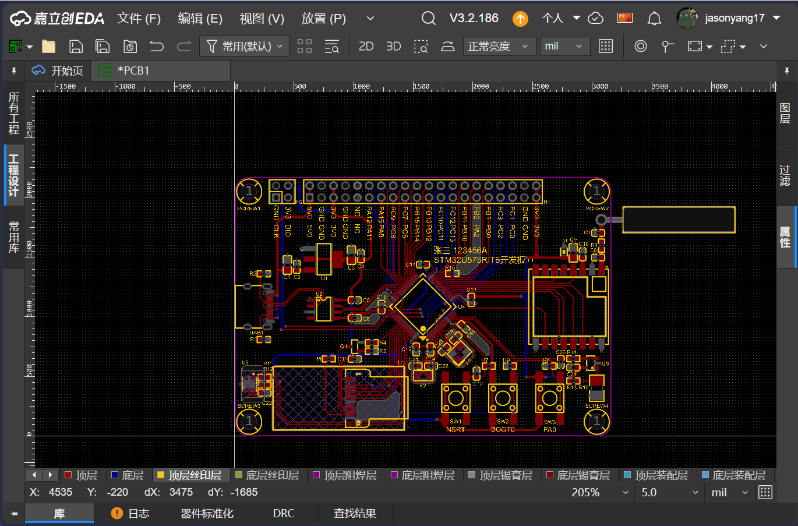
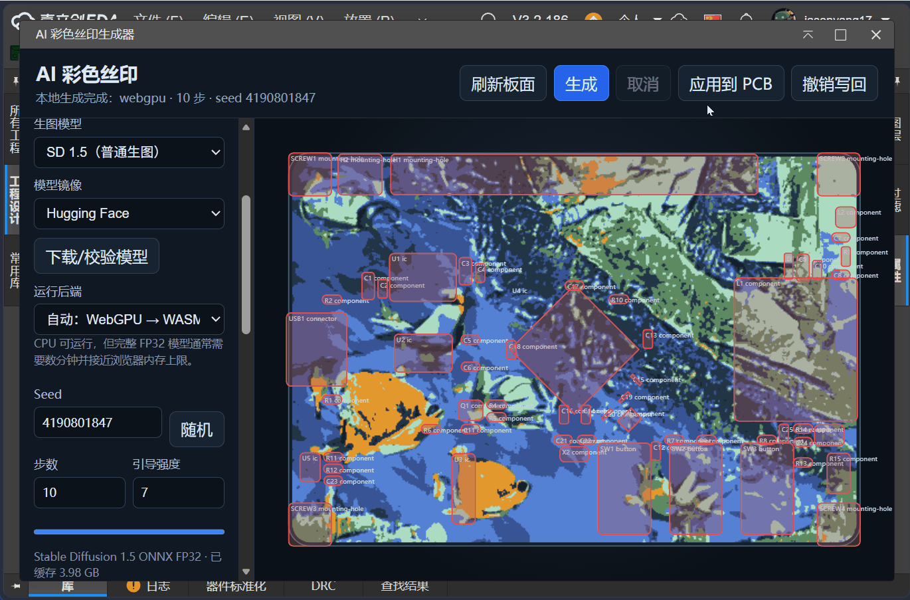
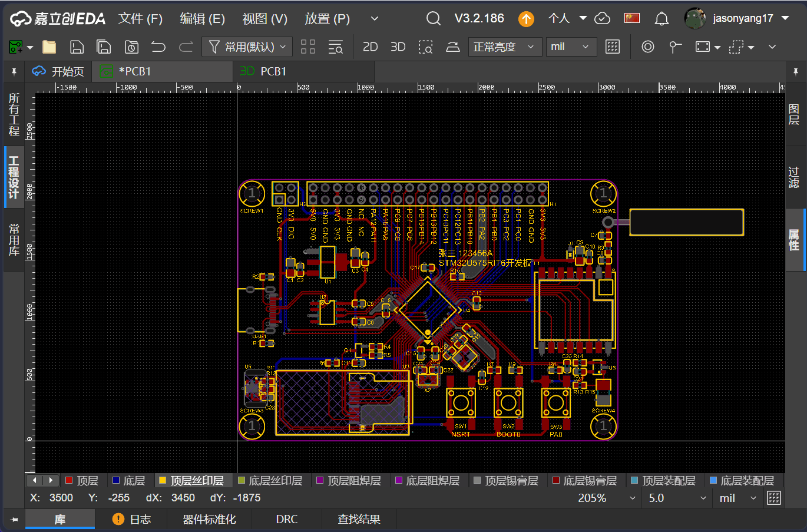
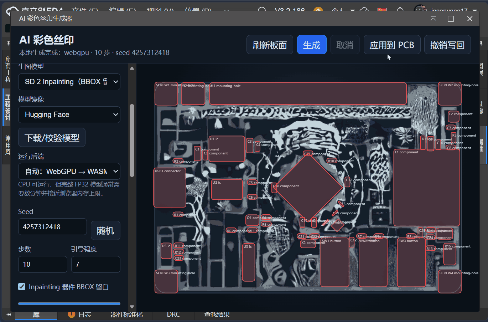
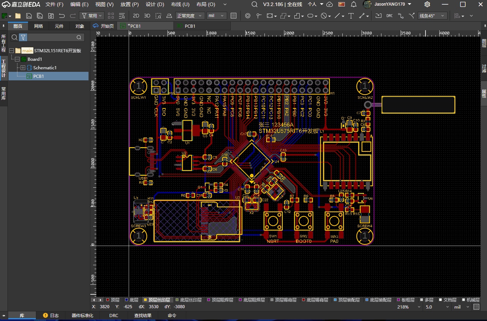
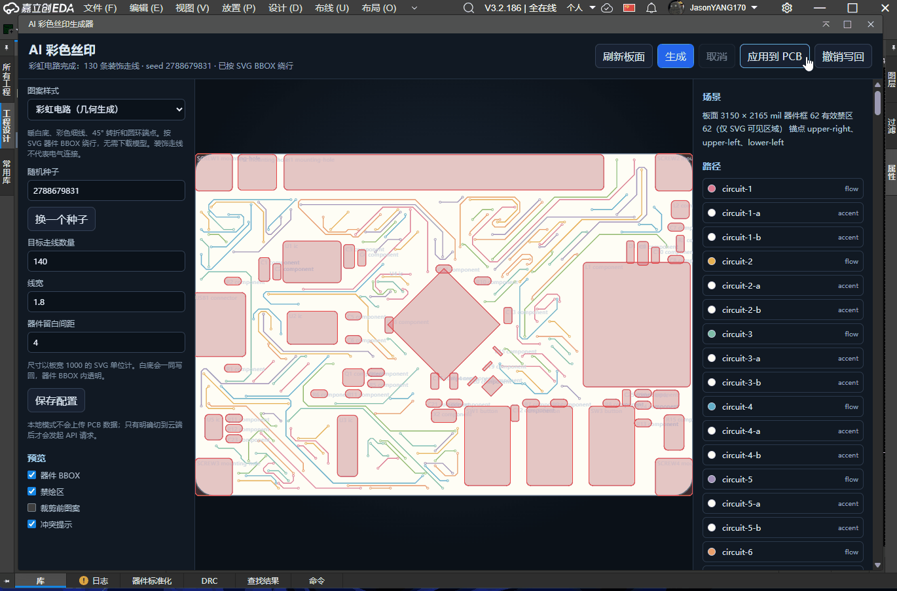

[简体中文](./README.md) | English

# AI Colorful Silkscreen Generator

A PCB colorful silkscreen generation extension built on [ONNX Runtime Web](https://github.com/microsoft/onnxruntime).
It reads the board outline and component BBOXes as generation conditions, runs Stable Diffusion natively inside the browser, and writes the result back to the top colorful silkscreen in one click.

- Default inpainting model: [sd15-inpainting-onnx-fp32](https://huggingface.co/JasonYANG170/sd15-inpainting-onnx-fp32)
- Default text-to-image model: [sd15-text-to-image-onnx-fp32](https://huggingface.co/JasonYANG170/sd15-text-to-image-onnx-fp32)
- Default model mirror: [🤗HuggingFace](https://huggingface.co/)

## Features

### ✅ Colorful silkscreen from a local generative model

This mode deploys a text-to-image model inside the browser.

#### Standard generation

The standard generation model produces a complete image from your description.

|  Image generation |  Result preview  |
| --- | --- |
|  |  |

#### Inpainting generation

Inpainting generation builds the image around the actual PCB layout positions.

|  Image generation |  Result preview  |
| --- | --- |
|  |  |

### ✅ Rainbow circuit from a random script

This mode needs neither a local model nor a cloud API, which makes it a good fit for low-performance devices. It uses a warm white background with thin colored traces, and plans decorative paths around the BBOXes. Seed, density, line width, and clearance spacing are all configurable.

|  Image generation |  Result preview  |
| --- | --- |
|  |  |

### ✅ Colorful silkscreen from a cloud model

- **LLM models**: OpenAI API compatible interface, generating SVG paths against a JSON Schema. (Results are relatively poor in this mode, so it is not recommended.)

- **Image models**: OpenAI API compatible `/images/generations` interface, accepting `data[0].b64_json` or an image URL.

### Notes on local mode

#### Supported model types

The extension is built on ONNX Runtime Web, with the scheduler, CFG, and latent packing implemented by hand. On first run it pulls the ONNX model online from the mirror by default. If the mirror is unreachable, you can also import a local ONNX model folder (source files are available from [HuggingFace](https://huggingface.co/) or [ModelScope](https://www.modelscope.cn/); when importing locally, just pick the source folder and it will be parsed automatically). Imported files are stored in the browser cache.

Only 512px FP32 / PNDM epsilon Diffusers ONNX directories are supported; a standalone `.onnx` file will not work. A directory import needs at least the following files, and one extra wrapping folder is allowed:

```text
model_index.json
scheduler/scheduler_config.json
tokenizer/{merges.txt,special_tokens_map.json,tokenizer_config.json,vocab.json}
text_encoder/model.onnx
unet/model.onnx
unet/model.onnx_data
vae_encoder/model.onnx
vae_decoder/model.onnx
```

#### Other notes

1. Running fully on a local model is demanding on hardware; a device with many cores, a high clock speed, and plenty of memory is recommended.
2. Before a local model runs, the extension reads the cache, loads ONNX, allocates memory, and initializes WASM, so the first use takes some preparation time and brief stalls are expected.
3. Prompts are best written in English — Chinese words the local CLIP tokenizer does not understand will be ignored.
4. Every generation rebuilds the Worker, so trying different seeds back to back requires reloading the UNet weights.

## Installation

1. Import the `.eext` extension file under "Advanced" - "Extension Manager".
2. Enable "Allow external interaction" under "Settings" (required for both downloading models and calling cloud APIs).
3. Open the PCB editor and click "AI Colorful Silkscreen" - "Open Generator" in the top navigation bar.

## Usage

1. The generator reads the board outline and components automatically once opened; you can also load the built-in demo board to check the interface.
2. Pick a pattern style and an engine. In local mode, click "Download / Verify Model" before the first run.
3. Enter your theme prompt and click "Generate". You can cancel at any time during the process, and the previous preview is kept.
4. Adjust colors and transparency with the raster processing controls, then click "Apply to PCB" when you are happy with the result. "Undo Write-back" reverts it.

## Acknowledgements

- [ONNX Runtime](https://github.com/microsoft/onnxruntime) — in-browser model inference
- [Transformers.js](https://github.com/huggingface/transformers.js) — CLIP tokenization
- [Diffusers](https://github.com/huggingface/diffusers) and [Optimum](https://github.com/huggingface/optimum) — ONNX model export
- [Stable Diffusion v1.5](https://huggingface.co/stable-diffusion-v1-5/stable-diffusion-v1-5) — open-source text-to-image model
- [🤗Hugging Face](https://huggingface.co/) — open-source AI community
- [Open Neural Network Exchange](https://github.com/onnx) — the ONNX community
